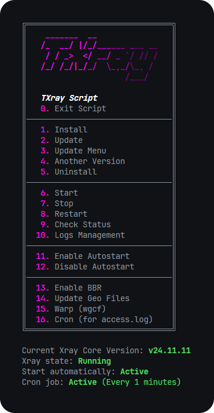

[English](/README.md)

<p align="center">
  <picture>
	<source media="(prefers-color-scheme: dark)" srcset="./media/txray-dark.png">
	
  </picture>
</p>

[](https://www.gnu.org/licenses/gpl-3.0.en.html)

## Install & Upgrade

```
bash <(curl -Ls https://raw.githubusercontent.com/tararostami/txray/master/txray.sh)
```

## Recommended OS

- Ubuntu 20.04+
- Debian 11+
- CentOS 8+
- Arch Linux
- Parch Linux
- Manjaro
- Armbian

## Preview

<picture>
  
</picture>