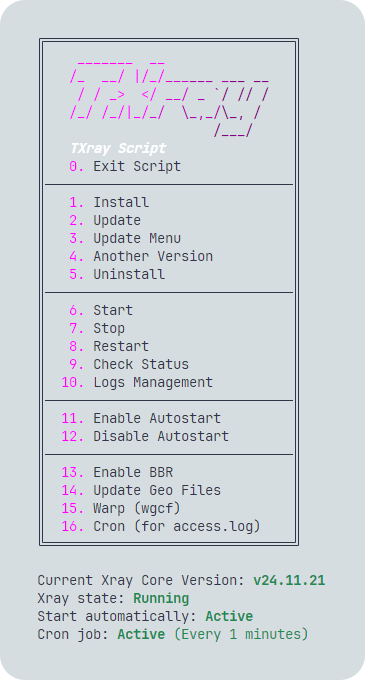

[English](/README.md)

<p align="center">
  <picture>
	  <source media="(prefers-color-scheme: dark)" srcset="./media/txray-dark.png">
	  
  </picture>
</p>

**A lightweight script to easily install and manage the Xray Core**

[](#)
[](https://www.gnu.org/licenses/gpl-3.0.en.html)

> **Disclaimer:** This project is only for personal learning and communication, please do not use it for illegal purposes, please do not use it in a production environment

## Run

```
bash <(curl -Ls https://raw.githubusercontent.com/tararostami/txray/master/txray.sh)
```

> **Tip:** After installation, you can edit the config.json file in /etc/xray/config.json path.

## Recommended OS

- Ubuntu
- Debian
- CentOS
- OpenEuler
- Fedora
- Arch Linux
- Parch Linux
- Manjaro
- Armbian
- AlmaLinux
- Rocky Linux
- Oracle Linux
- OpenSUSE Tumbleweed
- Amazon Linux 2023

## Features

- Install the latest version of Xray core
- Display version and status of Xray core
- Easy installation of different versions
- Option to install Warp and Warp+
- Add cron for access.log
- Completely clean uninstall
- Download and update geo files

## Preview

<picture>
  <source media="(prefers-color-scheme: dark)" srcset="./media/01-main-menu-dark.png">
  
</picture>