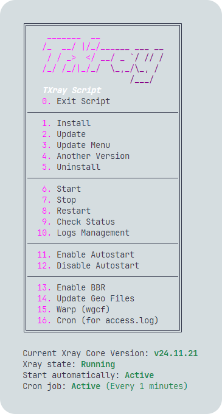

[English](/README.md)

<p align="center">
  <picture>
	  <source media="(prefers-color-scheme: dark)" srcset="./media/txray-dark.png">
	  
  </picture>
</p>

[](https://github.com/TaraRostami/TXray/blob/main/LICENSE)

**A lightweight script to easily install and manage the Xray Core**

> **Disclaimer:** This project is only for personal learning and communication, please do not use it for illegal purposes, please do not use it in a production environment

## Run

```bash
bash <(curl -Ls https://raw.githubusercontent.com/tararostami/txray/master/txray.sh)
```

> **Tip:** After installation, you can edit the config.json file in /etc/xray/config.json path.

## Recommended OS

- Ubuntu
- Debian
- CentOS
- OpenEuler
- Fedora
- Arch Linux
- Parch Linux
- Manjaro
- Armbian
- AlmaLinux
- Rocky Linux
- Oracle Linux
- OpenSUSE Tumbleweed
- Amazon Linux 2023

## Features

- Install the latest version of Xray Core
- Display version and status of Xray Core
- Install a specific Xray Core version
- Update TXray
- Session-wide proxy support for curl-based downloads
- Interactive proxy settings menu
- Proxy validation and connection testing
- Install WARP and WARP+
- Add cron for access.log cleanup
- Clean uninstall
- Download and update geo files

## Proxy Support

TXray supports session-wide proxy usage for all curl-based downloads.

You can use a proxy from the command line with the `TXRAY_PROXY` environment variable:

```bash
TXRAY_PROXY="socks5h://127.0.0.1:1080" txray install
```

> Note: Proxy support applies to TXray's curl-based downloads. Package manager traffic such as `apt`, `yum`, `dnf`, `pacman`, and external commands such as `wgcf register` are not automatically routed through this proxy setting.

## Preview

<picture>
  <source media="(prefers-color-scheme: dark)" srcset="./media/01-main-menu-dark.png">
  
</picture>